<div align="center">

# Projeção Financeira

**Saiba hoje quanto vai ter na conta em qualquer dia do ano.**

Controle e projeção financeira dia a dia, com a simplicidade de uma planilha e a clareza de um dashboard.

[](https://github.com/Mizerski/finance-sheet/releases/latest)
[](https://github.com/Mizerski/finance-sheet/releases/latest)
[](docs/como-rodar.md)
[](#web-ou-desktop)

**[⬇ Baixar para Windows](https://github.com/Mizerski/finance-sheet/releases/latest)** · [Ver as telas](#tudo-o-que-o-app-faz) · [Rodar o código](docs/como-rodar.md) · [Contribuir](docs/CONTRIBUTING.md)

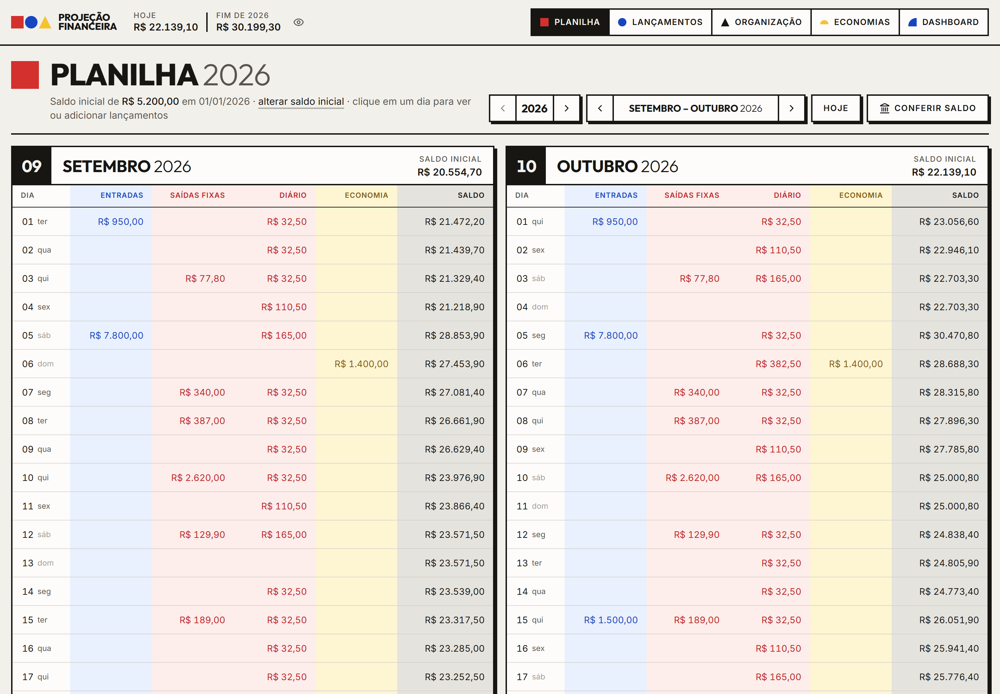

</div>

## Por que usar

Extrato de banco mostra o passado. A Projeção Financeira mostra o **futuro**: você cadastra o que entra e o que sai (salário, aluguel, a feira de sábado, o café dos dias úteis) e o app calcula o saldo de **cada dia**, até o fim do ano e além.

- **Descubra o aperto antes dele chegar.** O menor saldo do ano, o mês em que a conta fica no vermelho e quanto sobra no fim aparecem na hora.
- **Tão direto quanto uma planilha.** Dia, entradas, saídas, economia e saldo, lado a lado. Sem fórmula para quebrar.
- **Seus dados são seus.** No desktop, tudo fica num arquivo no seu computador e o app funciona sem internet. Na web, cada conta é isolada no banco.
- **Feito para o dia a dia.** Atalhos de teclado, busca, filtros que ficam onde você deixou e uma interface que funciona no celular.

## Tudo o que o app faz

> As imagens usam dados fictícios.

### Planilha: o saldo de cada dia

Os meses lado a lado com as colunas **Entradas | Saídas fixas | Diário | Economia | Saldo**. O saldo é acumulado dia a dia e continua de um ano para o outro. Hoje fica destacado, e o botão **Conferir saldo** compara a projeção com o saldo real do banco e cria o ajuste para você.

Clique em qualquer dia para ver o que entra e sai nele, e adicionar um lançamento ali mesmo:

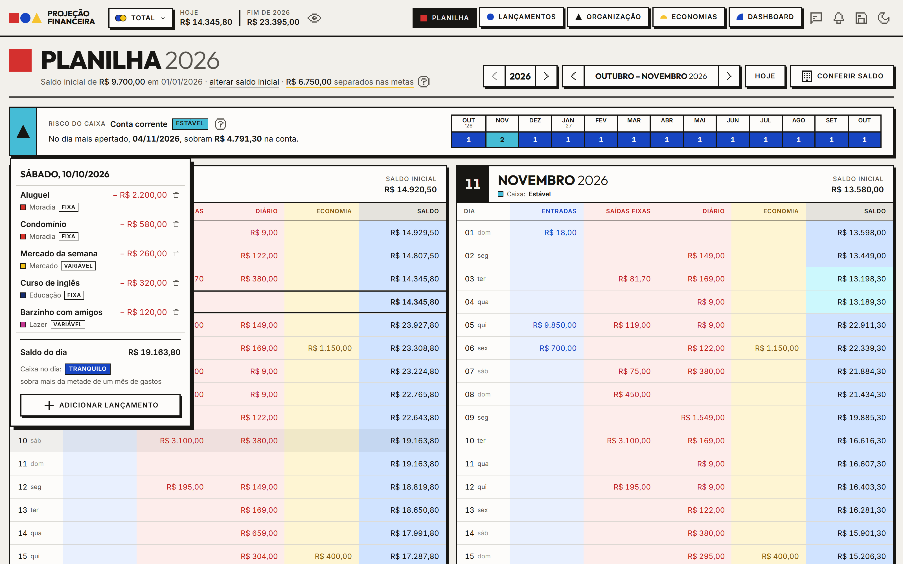

### Lançamentos: cadastre uma vez, projete o ano todo

Entradas e saídas **únicas, semanais, mensais ou diárias** (só em dias úteis, se quiser), com início e fim opcionais. Mudou o valor do aluguel? Edite "daqui para frente" sem reescrever o passado. Busca pela descrição, filtros por tipo, natureza, categoria e tag, e pastas que agrupam a lista com o total projetado no ano.

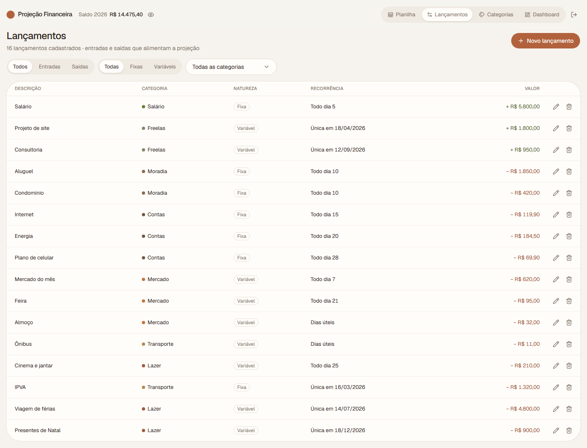

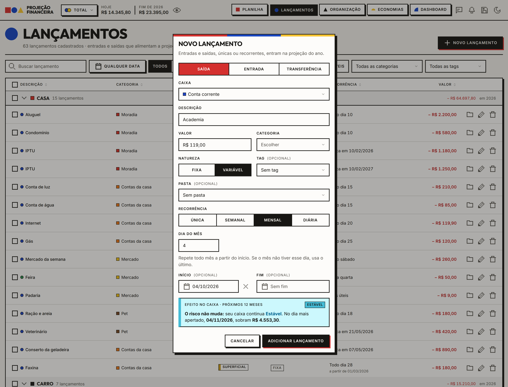

### Dashboard: o ano inteiro num relance

Entradas, saídas, saldo final projetado, menor saldo do ano e **gastos evitáveis**. Gráficos de saldo no fim de cada mês, entradas vs saídas, sobras, gastos por categoria, por tag e pelos próximos anos. Cada gráfico também vira tabela, e o relatório vale para um dia, uma semana, um mês, o ano ou qualquer intervalo que você escolher.

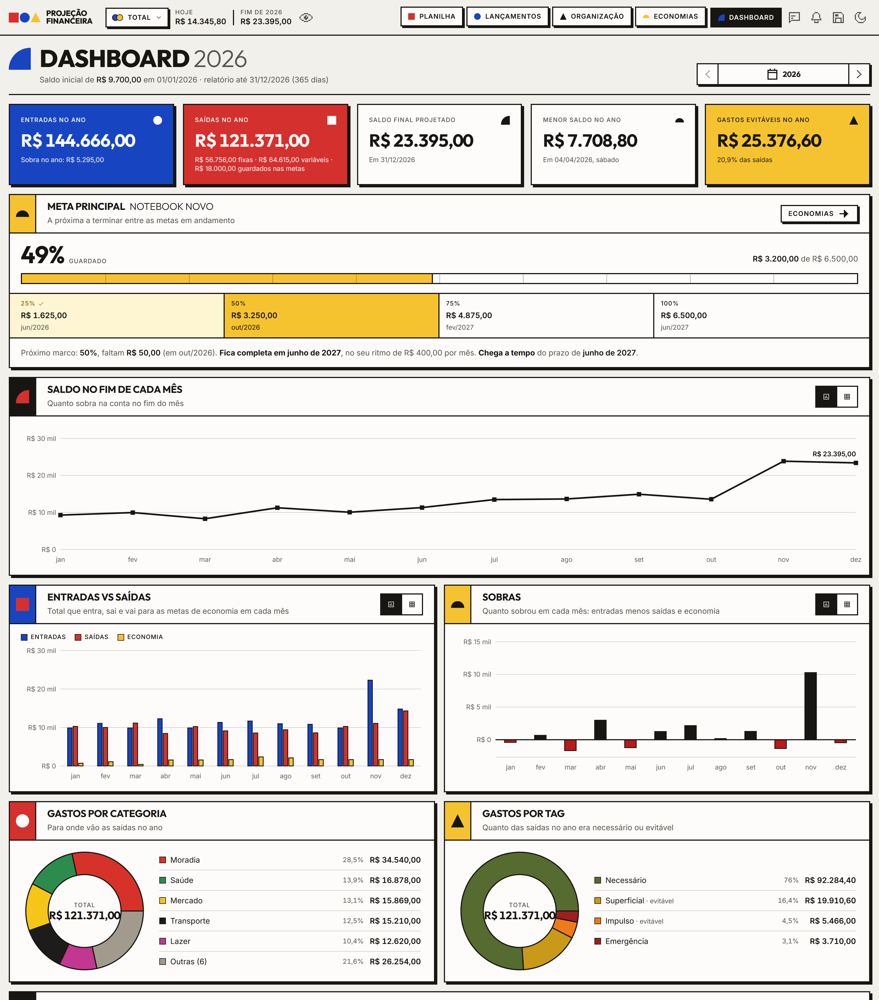

### Economias: metas que andam sozinhas

Defina o valor alvo e quanto guardar por mês. O app desconta os aportes do saldo (a coluna Economia da planilha), mostra o progresso, quanto falta e **em que mês a meta se completa** no seu ritmo. Guardou mais ou menos num mês? Registre o valor real e a previsão se ajusta. Logo abaixo, a sobra de cada mês: entradas menos saídas e economia.

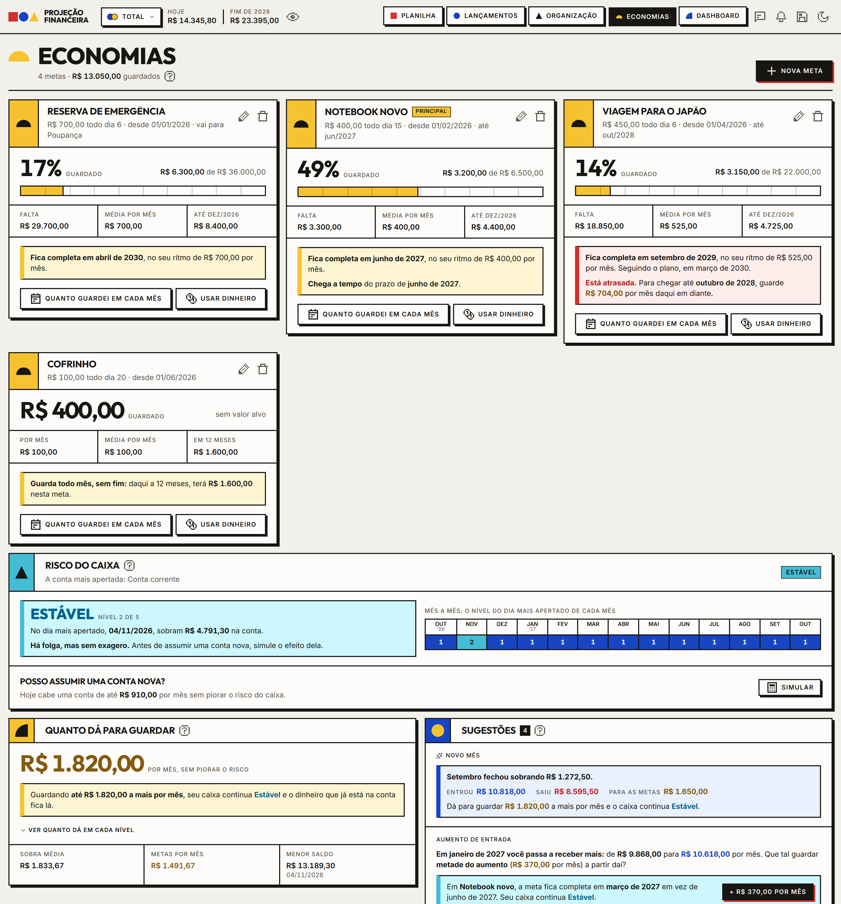

### Organização: categorias, tags e pastas

- **Categorias** agrupam entradas e saídas na planilha e nos gráficos, com o total de cada uma no ano.
- **Tags** dizem se um gasto era necessário ou evitável, e alimentam o indicador de gastos evitáveis.
- **Pastas** organizam a lista de lançamentos do jeito que fizer sentido para você.

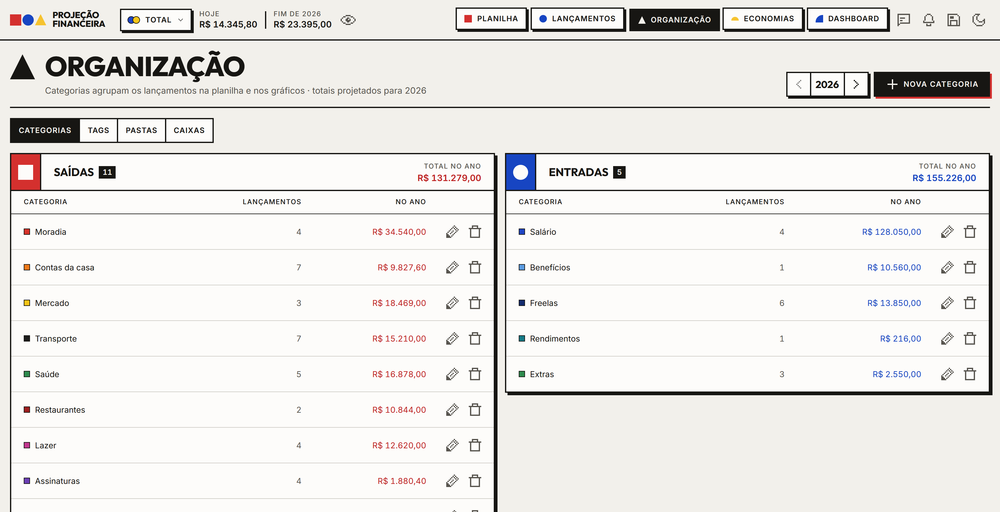

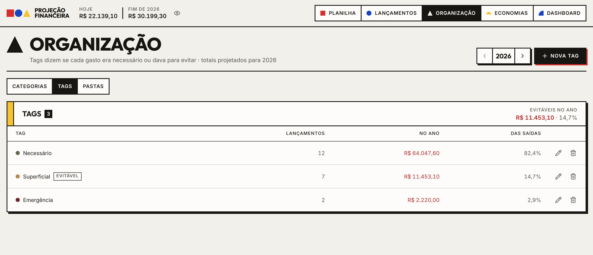

### No celular e no teclado

A interface se adapta até 375px de largura, sem rolagem lateral. No computador, atalhos levam a qualquer tela (`1`–`5`), criam um lançamento (`N`), buscam (`/`) e navegam pelos meses (`←` `→`). Aperte `?` para ver todos.

<table>
  <tr>
    <td width="25%">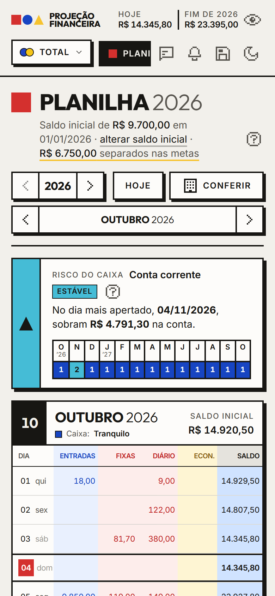</td>
    <td width="25%">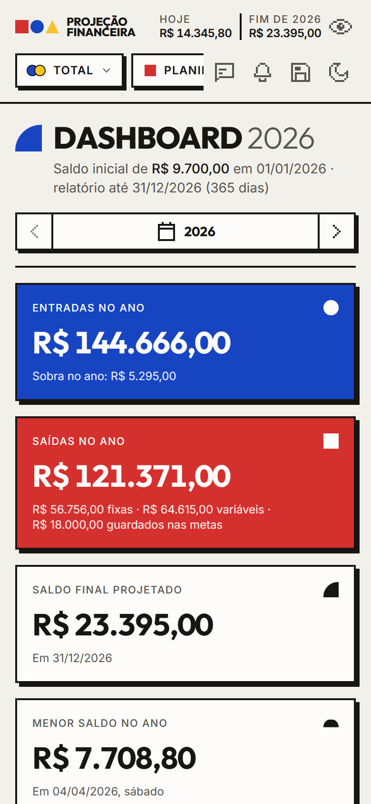</td>
    <td width="50%">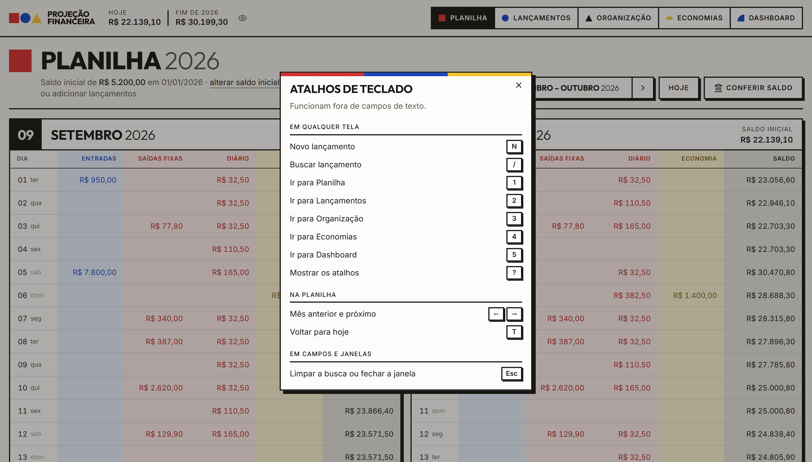</td>
  </tr>
</table>

## Web ou desktop

A mesma interface, em duas versões:

| | Desktop (Windows) | Web |
|---|---|---|
| **Onde ficam os dados** | Num arquivo no seu computador | No Supabase (Postgres), por conta |
| **Login** | Não precisa | E-mail e senha |
| **Internet** | Não precisa | Precisa |
| **Backup** | Exportar e importar um `.json` pelo cabeçalho | No banco |
| **Como usar** | [Baixe o instalador](#baixar) | [Rode com o seu projeto Supabase](docs/como-rodar.md#versão-web) |

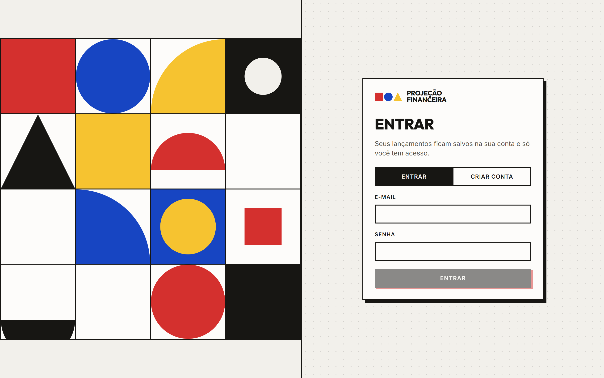

## Baixar

**[⬇ Baixar a última versão para Windows](https://github.com/Mizerski/finance-sheet/releases/latest)**. Em *Assets*, baixe o arquivo terminado em `_x64-setup.exe` (ou o `.msi`). Não precisa compilar nada.

1. Abra o app e informe o **saldo inicial** na Planilha.
2. Crie suas **categorias** em Organização.
3. Cadastre os **lançamentos**. A projeção aparece na hora.

Use o botão de **backup** no cabeçalho para exportar uma cópia dos dados de vez em quando.

Depois de instalado, o app avisa quando sai uma versão nova e se atualiza com um clique, sem perder os dados.

> O instalador não é assinado digitalmente. Se aparecer o aviso do SmartScreen, clique em **Mais informações** → **Executar assim mesmo**.

## Para desenvolvedores

O projeto é aberto a contribuições. Tudo o que você precisa está em [`docs/`](docs/README.md):

| Documento | O que tem |
|---|---|
| [Como rodar](docs/como-rodar.md) | Pré-requisitos, Supabase, app desktop, comandos e problemas comuns |
| [Tecnologias e arquitetura](docs/tecnologias.md) | A stack, como web e desktop dividem o mesmo front e como a projeção é calculada |
| [Convenções](docs/convencoes.md) | Organização por feature, rotas, estado, dinheiro, datas e nomes |
| [Design system](docs/design-system.md) | A linguagem visual Bauhaus: cores, formas, tipografia e componentes |
| [Como contribuir](docs/CONTRIBUTING.md) | Branches, commits, checklist do pull request e como publicar uma versão |

Em resumo:

```bash
git clone https://github.com/Mizerski/finance-sheet.git
cd finance-sheet
npm install
npm run desktop   # app desktop, sem precisar de Supabase (requer Rust)
npm run dev       # versão web (requer um projeto Supabase no .env.local)
```

Feito com React 19, TypeScript, Vite, Tailwind CSS 4, shadcn/ui, Recharts, TanStack Router, Supabase e Tauri 2.
