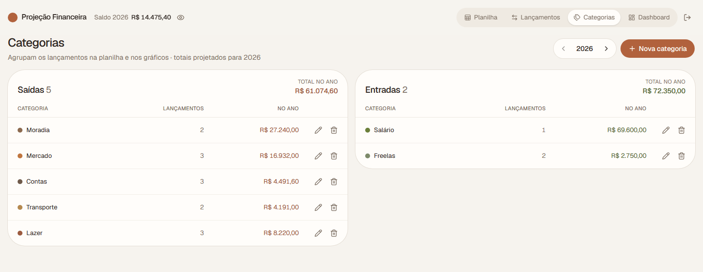

# Projeção Financeira

> **Versão 0.2** — agora também como app desktop para Windows, macOS e Linux.

Controle e projeção financeira dia a dia, no formato de uma planilha: **Dia | Entradas | Saídas fixas | Diário | Saldo**. Você cadastra entradas e saídas (únicas, mensais ou diárias), e o app acumula o saldo dia a dia, mostra quando a conta fica no negativo e resume tudo num dashboard.

## Baixar

**[⬇ Baixar a última versão](https://github.com/Mizerski/finance-sheet/releases/latest)**. Escolha o instalador do seu sistema em *Assets*; não precisa compilar nada.

| Sistema | Arquivo |
|---|---|
| Windows | `…_x64-setup.exe` (ou `.msi`) |
| macOS Apple Silicon (M1, M2…) | `…_aarch64.dmg` |
| macOS Intel | `…_x64.dmg` |
| Linux | `.AppImage`, `.deb` ou `.rpm` |

No app desktop não há login: os dados ficam só no seu computador e o app funciona sem internet. Use o botão de **backup** no cabeçalho para exportar uma cópia de vez em quando.

Os instaladores não são assinados digitalmente:

- **Windows:** se aparecer o aviso do SmartScreen, clique em **Mais informações** → **Executar assim mesmo**.
- **macOS:** se o sistema disser que o app está danificado, rode `xattr -cr "/Applications/Projeção Financeira.app"` no Terminal.

## Telas

As imagens usam dados fictícios.

### Planilha

Três meses lado a lado, com o saldo acumulado a cada dia. Clicar num dia mostra os lançamentos dele.


### Dashboard

Totais do período, saldo final projetado, menor saldo e gráficos de saldo, entradas vs saídas, gastos por categoria e fixas vs variáveis.


### Lançamentos

Cadastro de entradas e saídas com filtros por tipo, natureza e categoria.


### Categorias



### Entrar

Cada pessoa tem a sua conta. Os dados ficam no Supabase, protegidos por RLS: ninguém lê os dados de outra pessoa.


## Tecnologias

- **React 19 + TypeScript + Vite**
- **Tailwind CSS 4** e **shadcn/ui** (Radix), com design system próprio em tons terrosos ([docs/design-system.md](docs/design-system.md))
- **TanStack Router**: rotas com parâmetros de busca validados
- **Recharts**, pelo componente Chart do shadcn
- **date-fns**, com locale pt-BR
- **Supabase**: Postgres, autenticação por e-mail e senha, e RLS (versão web)
- **Tauri 2**: app desktop, com os dados num arquivo local

Valores são guardados em centavos (inteiros) e a lógica de projeção fica em funções puras (`src/features/projecao/projecao.ts`). O código segue *package by feature* (`src/features/<feature>`), com o que é compartilhado em `src/shared`.

## Como rodar

Pré-requisitos: Node.js 20 ou mais recente e uma conta no [Supabase](https://supabase.com).

### 1. Banco de dados

1. Crie um projeto no Supabase.
2. Em **SQL Editor → New query**, cole o conteúdo de [`supabase/migrations/20260928223817_esquema_inicial.sql`](supabase/migrations/20260928223817_esquema_inicial.sql) e clique em **Run**. Isso cria as tabelas e as regras de acesso.
3. Em **Authentication → URL Configuration**, defina a **Site URL** como `http://localhost:5173`. É para onde o link de confirmação de e-mail aponta.

> Se preferir a CLI do Supabase: `npx supabase link --project-ref <ref>` e depois `npx supabase db push`.

### 2. Variáveis de ambiente

Copie `.env.example` para `.env.local` e preencha com os dados do seu projeto (**Project Settings → API Keys**):

```bash
VITE_SUPABASE_URL=https://seu-projeto.supabase.co
VITE_SUPABASE_PUBLISHABLE_KEY=sb_publishable_...
```

Use a chave **publishable** (ou a antiga **anon**). Nunca coloque a `service_role` ou a secret key no front-end.

### 3. Rodar

```bash
npm install
npm run dev
```

Abra `http://localhost:5173`, crie sua conta e confirme o e-mail. Depois disso:

1. Informe o saldo inicial na Planilha.
2. Crie categorias.
3. Cadastre os lançamentos.

### Comandos

```bash
npm run dev      # servidor de desenvolvimento
npm run build    # typecheck + build de produção
npm run lint     # oxlint
```

## App desktop

A mesma interface, empacotada com [Tauri](https://tauri.app). No desktop **não há login nem Supabase**: os dados ficam num arquivo no seu computador (no Windows, `%APPDATA%\io.github.mizerski.projecaofinanceira\financas.json`), e o app funciona sem internet. O botão de backup exporta e importa esses dados num arquivo `.json`.

### Compilar no Windows

Pré-requisitos, além do Node.js:

- [Rust](https://rustup.rs) (toolchain `stable-x86_64-pc-windows-msvc`)
- Microsoft C++ Build Tools, com a carga de trabalho "Desenvolvimento para desktop com C++"
- WebView2 (já vem no Windows 10 e 11 atualizados)

```bash
npm install
npm run desktop         # abre o app em modo de desenvolvimento
npm run desktop:build   # gera os instaladores
```

Os instaladores ficam em `src-tauri/target/release/bundle/`: `nsis/*-setup.exe` e `msi/*.msi`.

### Publicar uma versão

A pipeline [`.github/workflows/release.yml`](.github/workflows/release.yml) gera os instaladores de Windows, macOS e Linux e os publica numa Release. Para disparar:

1. Atualize `version` no `package.json` (o Tauri lê de lá) e em `src-tauri/Cargo.toml`.
2. Faça o commit e crie a tag com a mesma versão:

```bash
git tag v0.2.0
git push origin v0.2.0
```

A release só é publicada se todos os instaladores forem gerados; se algum falhar, ela fica como rascunho.
