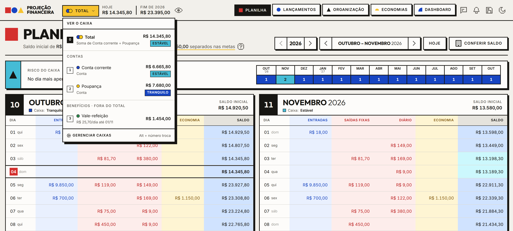
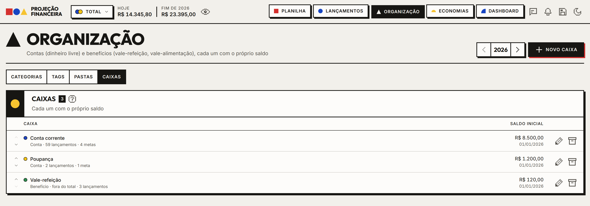
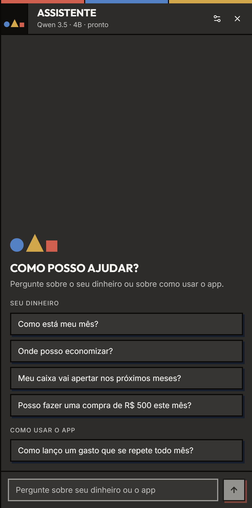
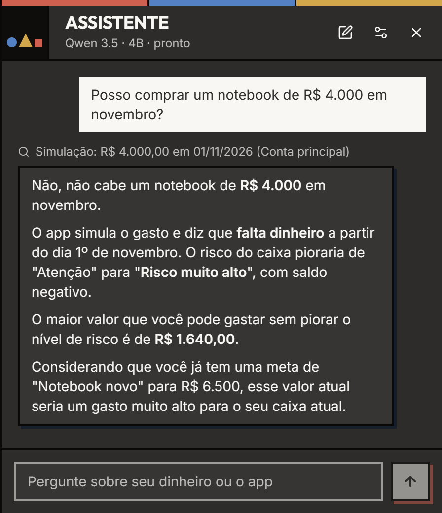
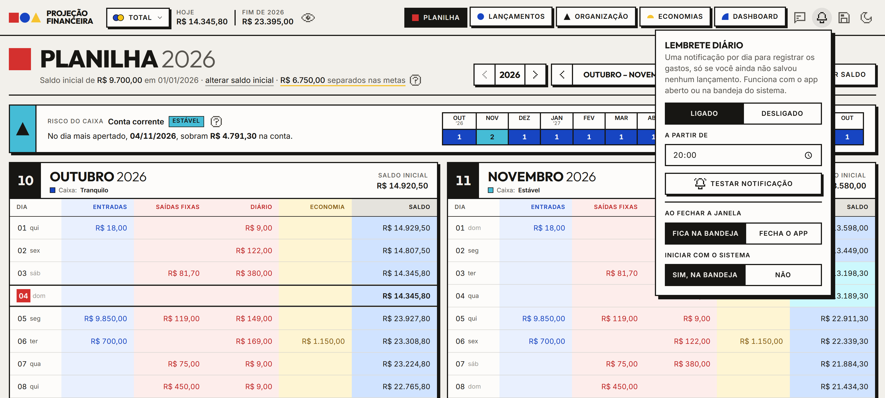
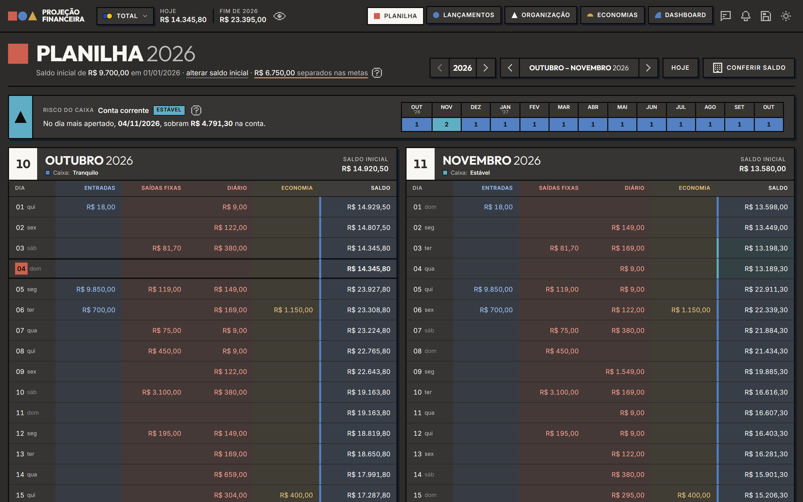

# Projeção Financeira

App para Windows que mostra quanto você vai ter na conta em cada dia do ano. Você cadastra o que entra e o que sai, e o app calcula o saldo dia a dia, como uma planilha com as colunas Dia, Entradas, Saídas, Diário, Economia e Saldo. O saldo de um ano continua no seguinte.

Os dados ficam num arquivo no seu computador. O app não pede conta nem precisa de internet.

[Baixar a última versão](https://github.com/Mizerski/finance-sheet/releases/latest)


> Todas as imagens usam dados de exemplo.

## Instalação

1. Abra a [página da última versão](https://github.com/Mizerski/finance-sheet/releases/latest) e, em *Assets*, baixe o arquivo terminado em `_x64-setup.exe` (ou o `.msi`).
2. Execute o instalador. Se o Windows mostrar o aviso do SmartScreen, clique em **Mais informações** e depois em **Executar assim mesmo**. O aviso aparece porque o instalador não tem assinatura digital.
3. Abra o app, informe o saldo inicial da conta na Planilha e comece a cadastrar os lançamentos.

Quando sai uma versão nova, o app avisa ao abrir. A atualização é instalada com um clique e não apaga os dados.

## Telas

### Planilha

Os meses aparecem lado a lado. Cada linha é um dia, com o que entra, o que sai e o saldo no fim do dia. O dia de hoje fica marcado.

- **Risco do caixa:** acima da planilha, o app mostra o dia mais apertado dos próximos 12 meses e quanto sobra nele. O nível vai de Tranquilo a Risco muito alto, comparando o saldo com quanto você gasta num mês. A cor da célula de saldo segue o nível do dia.
- **Conferir saldo:** compare a projeção com o saldo que o banco mostra. Se houver diferença, o app cria um ajuste.
- Clique num dia para ver os lançamentos dele, adicionar outro ou excluir.


### Lançamentos

Cada lançamento é uma entrada, uma saída ou uma transferência entre contas. Pode ser único, semanal, mensal ou diário (com a opção de só dias úteis), com data de início e de fim. Para mudar um valor a partir de certa data sem alterar o passado, edite "daqui para frente".

- Busca pela descrição e filtros por data, tipo, natureza (fixa ou variável), categoria e tag.
- Ordenação clicando no nome da coluna.
- Com pastas cadastradas, a lista fica agrupada por pasta, com o total projetado de cada uma.
- Seleção de vários lançamentos (Shift + clique marca um intervalo) para mudar categoria, tag, pasta ou caixa de uma vez, ou excluir. Toda alteração em lote pode ser desfeita.


Antes de salvar, o formulário mostra o efeito do lançamento no risco do caixa.


### Caixas: contas e benefícios

Você pode ter mais de um caixa, cada um com saldo inicial próprio:

- **Conta:** conta corrente, poupança, dinheiro. As contas somam no **Total**.
- **Benefício:** vale-refeição, vale-alimentação. Fica fora do Total, porque o dinheiro só serve para alguns gastos. Para cada benefício, o app mostra quanto sobra até a próxima recarga e quanto dá para gastar por dia.

O seletor ao lado do saldo troca o caixa exibido em todas as telas (atalhos Alt+0 para o Total e Alt+1 a Alt+9 para cada caixa). Com um caixa só, o seletor não aparece.



Os caixas são cadastrados em Organização, na aba Caixas.



### Economias

- **Metas:** defina quanto juntar, quanto guardar por mês e, se quiser, um prazo. O app desconta os aportes do saldo (coluna Economia da planilha), mostra quanto falta e em que mês a meta fica completa. Se o mês fugiu do plano, registre o valor real. Sem valor alvo, a meta funciona como um cofrinho que guarda todo mês. O dinheiro pode ficar separado na própria conta ou ir para outra (por exemplo, a poupança). "Usar dinheiro" registra uma retirada da meta.
- **Quanto dá para guardar:** o valor a mais por mês que dá para guardar sem piorar o risco do caixa.
- **Sugestões:** resumo do mês que fechou e sugestões de guardar parte de um aumento de salário ou de uma entrada extra.
- **Reserva de emergência:** quanto guardar para 3, 6 ou 12 meses de gastos essenciais.
- **Gastos grandes à frente:** contas únicas dos próximos 12 meses e o saldo no dia de cada uma.
- **Simulador:** "Posso assumir uma conta nova?" mostra o maior valor mensal que cabe sem piorar o risco.
- **Sobras:** entradas menos saídas e economia, mês a mês.


### Dashboard

Entradas, saídas, saldo final, menor saldo e gastos evitáveis do período. Gráficos de saldo no fim de cada mês, entradas e saídas, sobras, gastos por categoria, por tag, por pasta e nos próximos anos. Cada gráfico pode ser visto como tabela. O período pode ser um dia, uma semana, um mês, o ano ou um intervalo qualquer. A meta mais perto de terminar aparece no topo, com o progresso em marcos de 25%.


### Organização

- **Categorias** agrupam entradas e saídas.
- **Tags** dizem se uma saída era necessária ou evitável. As evitáveis somam no indicador de gastos evitáveis.
- **Pastas** organizam a lista de lançamentos (Casa, Carro, Trabalho...). Não mudam a projeção.

Categorias, tags e pastas também podem ser criadas direto no formulário de lançamento.


### Assistente

Um chat para tirar dúvidas sobre o app e perguntar sobre as suas finanças: como está o mês, quanto você gastou com algo num período, qual o saldo num dia, se uma compra cabe no orçamento. Abre pelo botão do cabeçalho ou pela tecla **A**.

O modelo de IA roda no seu computador. Nenhum dado sai da máquina. Na primeira vez, o app pede para baixar um modelo (cerca de 3 GB) e sugere qual combina com o seu computador. O download pode ser pausado e continua de onde parou.

Quando o assistente consulta os seus lançamentos, a resposta mostra o que foi consultado. É um modelo pequeno e pode errar: confira os números nas telas antes de decidir algo importante.

<table>
  <tr>
    <td width="50%"></td>
    <td width="50%"></td>
  </tr>
</table>

## Outros recursos

- **Lembrete diário:** uma notificação por dia, no horário escolhido, se você ainda não registrou nenhum lançamento.
- **Bandeja do sistema:** fechar a janela pode deixar o app na bandeja, e ele pode iniciar junto com o Windows.
- **Backup:** exporte e importe um arquivo `.json` pelo botão do cabeçalho.
- **Ocultar saldos:** o botão do olho borra os valores até você passar o mouse em cima.
- **Tema escuro:** segue o sistema ou a escolha feita no botão do cabeçalho.
- **Atalhos de teclado:** `1` a `5` trocam de tela, `N` cria um lançamento, `/` busca, `←` e `→` mudam o mês, `T` volta para hoje e `?` mostra a lista completa.





A interface também funciona em janelas estreitas:

<table>
  <tr>
    <td width="25%"></td>
    <td width="25%"></td>
    <td width="50%"></td>
  </tr>
</table>

## Onde ficam os dados

Em `%APPDATA%\io.github.mizerski.projecaofinanceira\financas.json`. Os modelos do assistente ficam na pasta `modelos` do mesmo diretório e não entram no backup.

## Desenvolvimento

Requer Node.js, Rust e as Microsoft C++ Build Tools. Os detalhes estão em [Como rodar](docs/como-rodar.md).

```bash
git clone https://github.com/Mizerski/finance-sheet.git
cd finance-sheet
npm install
npm run desktop
```

| Comando | O que faz |
|---|---|
| `npm run desktop` | App em modo de desenvolvimento |
| `npm run desktop:build` | Gera os instaladores em `src-tauri/target/release/bundle/` |
| `npm run build` | Checagem de tipos e build do front |
| `npm run lint` | Lint com oxlint |

Documentação:

| Documento | Conteúdo |
|---|---|
| [Como rodar](docs/como-rodar.md) | Pré-requisitos, comandos e problemas comuns |
| [Tecnologias e arquitetura](docs/tecnologias.md) | Stack, estrutura de pastas e cálculo da projeção |
| [Convenções](docs/convencoes.md) | Organização do código, estado, dinheiro, datas e nomes |
| [Design system](docs/design-system.md) | Cores, formas, tipografia e componentes |
| [Como contribuir](docs/CONTRIBUTING.md) | Branches, commits, pull requests e publicação de versões |

Os prints deste README são gerados com dados de exemplo: `npx vite --config scripts/demo/vite.config.ts` abre o app no navegador com o Tauri simulado.

Feito com Tauri 2, React 19, TypeScript, Vite, Tailwind CSS 4, shadcn/ui, Recharts, TanStack Router e llama.cpp.
